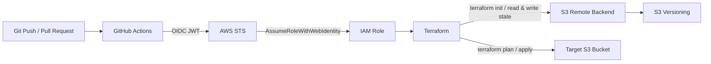

# Terraform AWS CI/CD with GitHub Actions and OIDC

A hands-on Terraform project demonstrating AWS infrastructure deployment from GitHub Actions using OpenID Connect (OIDC) authentication.

The workflow authenticates to AWS without storing long-lived AWS access keys in GitHub. GitHub Actions requests an OIDC JSON Web Token (JWT), AWS STS validates the token against an IAM role trust policy, and Terraform receives temporary AWS credentials to manage infrastructure.

The lab uses an Amazon S3 bucket as the deployment target and an S3 remote backend to persist Terraform state between ephemeral GitHub-hosted runners.

## Architecture



## What This Project Demonstrates

- Terraform infrastructure provisioning
- GitHub Actions CI/CD
- GitHub OIDC authentication with AWS
- AWS STS `AssumeRoleWithWebIdentity`
- IAM trust policies for GitHub Actions
- Temporary AWS credentials instead of long-lived access keys
- Terraform `fmt`, `init`, `validate`, `plan`, and `apply`
- Terraform remote state with an S3 backend
- S3 Versioning for state history and recovery
- Troubleshooting OIDC authentication by inspecting JWT claims
- Troubleshooting Terraform state persistence in ephemeral CI runners

## Repository Structure

```text
.
├── .github/
│   └── workflows/
│       └── main.yml
│
├── IAM_S3_precreated/
│   ├── IAM_OIDC.tf
│   ├── backend_s3.tf
│   └── output.tf
│
├── terraform/
│   ├── backend.tf
│   ├── main.tf
│   ├── variables.tf
│   └── terraform.tfvars
│
└── README.md
```

## Bootstrap Design

OIDC authentication and remote state both introduce bootstrap dependencies.

GitHub Actions cannot assume the deployment IAM role until the GitHub OIDC provider and IAM role already exist. Likewise, Terraform cannot use an S3 backend until the backend bucket already exists.

Therefore, the resources under `IAM_S3_precreated/` are created first from an already authenticated local Terraform environment.

The bootstrap layer creates:

- GitHub OIDC provider
- GitHub Actions IAM role and trust policy
- S3 bucket for Terraform remote state
- S3 Versioning for state history

```text
Local authenticated environment
        |
        v
Bootstrap Terraform
        |
        +--> GitHub OIDC Provider
        +--> GitHub Actions IAM Role
        +--> Terraform State S3 Bucket
                    |
                    +--> Versioning enabled

After bootstrap
        |
        v
GitHub Actions --> OIDC --> AWS STS --> IAM Role --> Terraform
                                              |
                                              +--> Remote State S3
                                              +--> Target AWS Resources
```

The bootstrap state itself is separate from the state used by the GitHub Actions-managed infrastructure.

## OIDC Authentication Flow

The project does not store an AWS Access Key ID or Secret Access Key in GitHub.

```text
GitHub Actions
      |
      | requests OIDC JWT
      v
GitHub OIDC Provider
      |
      | signed identity token
      v
AWS STS
      |
      | AssumeRoleWithWebIdentity
      v
IAM Role
      |
      | temporary AWS credentials
      v
Terraform
```

GitHub Actions requires permission to request an OIDC token:

```yaml
permissions:
  id-token: write
  contents: read
```

The AWS credentials action then exchanges the GitHub identity for temporary AWS credentials:

```yaml
- name: Configure AWS credentials
  uses: aws-actions/configure-aws-credentials@v6
  with:
    role-to-assume: ${{ vars.IAM_ROLE_ARN }}
    aws-region: ${{ env.AWS_REGION }}
```

`IAM_ROLE_ARN` is configured as a GitHub repository variable so that the AWS account-specific ARN does not need to be committed to the public repository.

## IAM Trust Policy

The IAM role trusts GitHub's OIDC provider and permits:

```text
sts:AssumeRoleWithWebIdentity
```

The trust relationship validates both the token audience and subject.

Example with public placeholders:

```hcl
Condition = {
  StringEquals = {
    "token.actions.githubusercontent.com:aud" = "sts.amazonaws.com"
  }

  StringLike = {
    "token.actions.githubusercontent.com:sub" = "repo:<owner>@<owner-id>/<repository>@<repository-id>:*"
  }
}
```

Repository-specific identifiers are intentionally represented with placeholders in this public repository.

## Terraform Remote State

GitHub-hosted runners are ephemeral. A local `terraform.tfstate` created during one workflow run is not available to the next runner.

Without persistent state, a later run may incorrectly plan to recreate resources that already exist in AWS:

```text
First workflow run
Terraform creates resource
        |
        v
Local state exists only on runner
        |
        v
Runner terminates
        |
        v
Local state is lost

Next workflow run
Terraform sees no state
        |
        v
Plan: resource will be created
        |
        v
AWS: resource already exists
```

During this lab, this behavior produced an S3 error:

```text
Plan: 1 to add, 0 to change, 0 to destroy

BucketAlreadyOwnedByYou
StatusCode: 409
```

This confirmed that AWS authentication was working, but Terraform state was not being persisted between workflow runs.

### S3 Backend

The main Terraform configuration therefore uses an S3 remote backend:

```hcl
terraform {
  backend "s3" {
    bucket = "<TERRAFORM_STATE_BUCKET>"
    key    = "github-actions-oidc-ci/terraform.tfstate"
    region = "ap-northeast-1"
  }
}
```

`terraform init` initializes the backend and retrieves the current state. After a successful `terraform apply`, Terraform writes the updated state back to S3 automatically.

The workflow does **not** manually copy `terraform.tfstate` to or from S3.

```text
terraform init
      |
      v
Read remote state from S3
      |
      v
terraform plan
      |
      v
Compare configuration + state + AWS
      |
      v
terraform apply
      |
      v
Write updated state to S3
```

### State History

S3 Versioning is enabled on the backend bucket so previous versions of the state object can be retained for recovery.

```hcl
resource "aws_s3_bucket_versioning" "terraform_state" {
  bucket = aws_s3_bucket.terraform_state.id

  versioning_configuration {
    status = "Enabled"
  }
}
```

Terraform state is not committed to Git. State files can contain infrastructure details and are operational data rather than source code.

## GitHub Actions Workflow

The workflow is triggered by pushes and pull requests targeting `main` and runs Terraform from the `terraform/` directory.

```text
Push / Pull Request
        |
        v
Checkout
        |
        v
Setup Terraform
        |
        v
Authenticate to AWS via OIDC
        |
        v
terraform fmt -check
        |
        v
terraform init
        |
        v
terraform validate
        |
        v
terraform plan
        |
        v
terraform apply
```

For a production-style pipeline, `terraform apply` should normally be restricted to trusted deployment events such as a push/merge to `main`, while pull requests run validation and `terraform plan` only.

Example:

```yaml
- name: Terraform Apply
  if: github.event_name == 'push' && github.ref == 'refs/heads/main'
  run: terraform apply -auto-approve
```

## Deployment

### 1. Bootstrap OIDC, IAM, and the state backend

Run the Terraform configuration under:

```text
IAM_S3_precreated/
```

```bash
terraform init
terraform plan
terraform apply
```

### 2. Configure the GitHub repository variable

In the GitHub repository:

```text
Settings
→ Secrets and variables
→ Actions
→ Variables
```

Create:

```text
IAM_ROLE_ARN
```

with the complete IAM role ARN created during bootstrap.

### 3. Configure the remote backend

Set the backend bucket name in `terraform/backend.tf` using the S3 bucket created during bootstrap.

The public repository uses placeholders for account- and repository-specific values.

### 4. Push the Terraform configuration

Push changes to the repository. GitHub Actions requests an OIDC token, assumes the AWS IAM role, initializes the S3 backend, and runs the Terraform pipeline.

## Troubleshooting OIDC Authentication

During development, the workflow initially failed with:

```text
Could not assume role with OIDC:
Not authorized to perform sts:AssumeRoleWithWebIdentity
```

The authentication path was checked step by step instead of changing multiple settings at once.

### 1. Verify the IAM Role ARN

```powershell
aws iam get-role `
  --role-name github-actions-terraform-role `
  --query "Role.Arn" `
  --output text
```

The value passed to `role-to-assume` must be a complete IAM role ARN.

To isolate a repository-variable problem, the ARN can temporarily be supplied directly to the workflow. If the same STS error remains, the GitHub variable itself is not the cause.

### 2. Verify the IAM Role Trust Policy

```powershell
aws iam get-role `
  --role-name github-actions-terraform-role `
  --query "Role.AssumeRolePolicyDocument" `
  --output json
```

Check that:

- `Principal.Federated` points to the GitHub OIDC provider
- `Action` is `sts:AssumeRoleWithWebIdentity`
- `aud` matches `sts.amazonaws.com`
- `sub` matches the identity issued by GitHub

### 3. Verify the GitHub OIDC Provider

```powershell
aws iam list-open-id-connect-providers `
  --output table
```

Then inspect the provider:

```powershell
aws iam get-open-id-connect-provider `
  --open-id-connect-provider-arn "arn:aws:iam::<AWS_ACCOUNT_ID>:oidc-provider/token.actions.githubusercontent.com"
```

Expected values include:

```text
Url: token.actions.githubusercontent.com
ClientIDList: sts.amazonaws.com
```

### 4. Inspect the Actual GitHub OIDC JWT Claims

If the AWS configuration appears correct but STS still rejects the request, the actual JWT claims can be inspected from the workflow.

Add this temporary step before `Configure AWS credentials`:

```yaml
- name: Check OIDC claims
  shell: bash
  run: |
    RESPONSE=$(curl -sS \
      -H "Authorization: bearer $ACTIONS_ID_TOKEN_REQUEST_TOKEN" \
      "${ACTIONS_ID_TOKEN_REQUEST_URL}&audience=sts.amazonaws.com")

    TOKEN=$(echo "$RESPONSE" | jq -r '.value')

    python3 - "$TOKEN" <<'PY'
    import sys
    import json
    import base64

    token = sys.argv[1]
    payload = token.split('.')[1]
    payload += '=' * (-len(payload) % 4)

    claims = json.loads(base64.urlsafe_b64decode(payload))

    print("aud:", claims.get("aud"))
    print("sub:", claims.get("sub"))
    print("repository:", claims.get("repository"))
    print("ref:", claims.get("ref"))
    PY
```

Example sanitized output:

```text
aud: sts.amazonaws.com
sub: repo:<owner>@<owner-id>/<repository>@<repository-id>:ref:refs/heads/main
repository: <owner>/<repository>
ref: refs/heads/main
```

The JWT itself is short-lived and changes between requests. The relevant repository identity in the `sub` claim must match the IAM trust policy.

### 5. Compare JWT Claims with the Trust Policy

```text
GitHub Actions workflow      OK
        ↓
OIDC token request           OK
        ↓
JWT aud                      OK
        ↓
JWT sub                      MISMATCH
        ↓
IAM Trust Policy             DENIED
        ↓
sts:AssumeRoleWithWebIdentity failed
```

In this lab, inspecting the actual JWT revealed that the `sub` claim did not match the subject originally configured in the IAM role trust policy. Updating the trust condition to match the actual GitHub OIDC subject resolved the role-assumption failure.

The JWT inspection step is for troubleshooting and is removed or commented out after verification.

## Troubleshooting Terraform State

After OIDC authentication was fixed, a later workflow reached `terraform apply` but failed with:

```text
BucketAlreadyOwnedByYou
StatusCode: 409
```

The important clue was:

```text
Plan: 1 to add, 0 to change, 0 to destroy
```

The target bucket already existed in AWS, but the new GitHub-hosted runner did not have the state created by the previous run.

This separated the problem from authentication:

```text
OIDC token issuance          OK
AWS STS role assumption      OK
AWS API access               OK
Terraform plan               OK
        ↓
State persistence            MISSING
        ↓
Terraform attempts recreate
        ↓
AWS returns 409
```

The solution is to persist state in the S3 remote backend rather than relying on runner-local state.

## Security Notes

- No long-lived AWS access keys are stored in GitHub.
- GitHub Actions receives short-lived AWS credentials through OIDC and AWS STS.
- The IAM trust policy restricts which GitHub identity can assume the role.
- Repository/account-specific values are represented with placeholders in public Terraform examples where appropriate.
- The actual IAM role ARN is supplied through a GitHub repository variable.
- Terraform state is stored outside Git and the backend bucket has Versioning enabled.
- The lab currently uses `AmazonS3FullAccess` for simplicity; a production environment should use least-privilege permissions for both the backend and deployed resources.

## Future Improvements

- Replace `AmazonS3FullAccess` with a least-privilege IAM policy
- Restrict `terraform apply` to pushes/merges to `main`
- Run validation and `terraform plan` only on pull requests
- Add GitHub Environment approval before production deployment
- Add state locking appropriate to the selected Terraform/S3 backend configuration
- Encrypt and further harden the state backend
- Add deployment notifications
- Extend the pipeline to deploy additional AWS infrastructure
