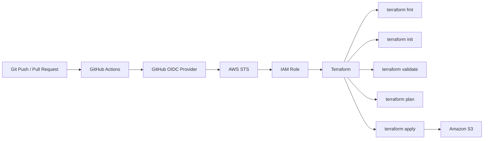

# Terraform AWS CI/CD with GitHub Actions and OIDC

A hands-on Terraform project demonstrating how to deploy AWS infrastructure from GitHub Actions using OpenID Connect (OIDC) authentication.

The workflow authenticates to AWS without storing long-lived AWS access keys in GitHub, assumes an IAM role through AWS STS, validates the Terraform configuration, generates a plan, and applies the infrastructure.

This lab deploys an Amazon S3 bucket as a simple target resource.

## Architecture



## What This Project Demonstrates

- Terraform infrastructure provisioning
- GitHub Actions CI/CD workflow
- GitHub OIDC authentication with AWS
- AWS STS `AssumeRoleWithWebIdentity`
- IAM trust policies for GitHub Actions
- AWS authentication without long-lived access keys
- Automated Terraform validation, planning, and deployment
- S3 provisioning through Terraform

## Repository Structure

```text
.
├── .github/
│   └── workflows/
│       └── main.yml
│
├── IAM_precreated/
│   ├── IAM_OIDC.tf
│   └── output.tf
│
├── terraform/
│   ├── main.tf
│   ├── variables.tf
│   └── terraform.tfvars
│
└── README.md
```

### `IAM_precreated/`

Contains the bootstrap configuration for the GitHub OIDC provider and IAM role.

This configuration must initially be applied outside GitHub Actions because the workflow cannot assume an IAM role until the OIDC provider and trust relationship already exist.

### `terraform/`

Contains the infrastructure deployed by the GitHub Actions workflow.

The current lab deploys an S3 bucket.

## Authentication Flow

The project does not store an AWS Access Key ID or Secret Access Key in GitHub.

Instead, authentication works as follows:

```text
GitHub Actions
      |
      | requests OIDC JWT
      v
GitHub OIDC Provider
      |
      | signed identity token
      v
AWS STS
      |
      | AssumeRoleWithWebIdentity
      v
IAM Role
      |
      | temporary AWS credentials
      v
Terraform
      |
      v
AWS resources
```

GitHub Actions requires the following permission to request an OIDC token:

```yaml
permissions:
  id-token: write
  contents: read
```

The AWS credential action then exchanges the GitHub OIDC identity for temporary AWS credentials:

```yaml
- name: Configure AWS credentials
  uses: aws-actions/configure-aws-credentials@v6
  with:
    role-to-assume: ${{ vars.IAM_ROLE_ARN }}
    aws-region: ${{ env.AWS_REGION }}
```

## IAM Trust Policy

The IAM role trusts GitHub's OIDC provider and allows:

```text
sts:AssumeRoleWithWebIdentity
```

The trust policy validates both the OIDC audience and subject.

Example:

```hcl
Condition = {
  StringEquals = {
    "token.actions.githubusercontent.com:aud" = "sts.amazonaws.com"
  }

  StringLike = {
    "token.actions.githubusercontent.com:sub" = "repo:<owner>@<owner-id>/<repository>@<repository-id>:*"
  }
}
```

The repository and owner IDs are stable identifiers used by GitHub's OIDC subject format.

This prevents unrelated GitHub repositories from assuming the IAM role.

## GitHub Actions Workflow

The workflow runs when changes are pushed to `main` or when a pull request targets `main`.

```text
Push / Pull Request
        |
        v
Checkout repository
        |
        v
Setup Terraform
        |
        v
Authenticate to AWS via OIDC
        |
        v
terraform fmt -check
        |
        v
terraform init
        |
        v
terraform validate
        |
        v
terraform plan
        |
        v
terraform apply
```

The Terraform commands run from the `terraform/` directory.

## Bootstrap

OIDC authentication introduces a bootstrap dependency:

```text
GitHub Actions needs IAM Role
        ^
        |
IAM Role needs to exist first
```

Therefore, the resources under `IAM_precreated/` are created first using an already authenticated Terraform environment.

After the OIDC provider and IAM role exist, GitHub Actions can assume the role and manage the target infrastructure.

## Deployment

### 1. Bootstrap the OIDC provider and IAM role

Apply the configuration under:

```text
IAM_precreated/
```

For example:

```bash
terraform init
terraform plan
terraform apply
```

### 2. Configure the GitHub repository variable

In the GitHub repository:

```text
Settings
→ Secrets and variables
→ Actions
→ Variables
```

Create:

```text
IAM_ROLE_ARN
```

with the ARN of the IAM role created during bootstrap.

Example format:

```text
arn:aws:iam::<AWS_ACCOUNT_ID>:role/github-actions-terraform-role
```

### 3. Push the Terraform configuration

Push changes to `main`.

GitHub Actions will automatically run the Terraform workflow.

## Verification

After a successful workflow run, the S3 bucket can be verified with the AWS CLI:

```bash
aws s3 ls
```

Or verify a specific bucket:

```bash
aws s3api head-bucket \
  --bucket <BUCKET_NAME>
```

## Troubleshooting OIDC Authentication

During development, the workflow initially failed with:

```text
Not authorized to perform sts:AssumeRoleWithWebIdentity
```

The issue was isolated by inspecting the actual claims contained in the GitHub-issued OIDC JWT.

The relevant claims included:

```text
aud: sts.amazonaws.com
sub: repo:<owner>@<owner-id>/<repository>@<repository-id>:ref:refs/heads/main
repository: <owner>/<repository>
ref: refs/heads/main
```

The IAM trust policy must match the actual `aud` and `sub` claims issued by GitHub.

This troubleshooting process helped verify the complete authentication path:

```text
GitHub Actions
→ OIDC JWT
→ AWS STS
→ IAM Trust Policy
→ IAM Role
→ Temporary AWS credentials
```

## Security Notes

This lab avoids storing long-lived AWS credentials in GitHub.

OIDC provides short-lived credentials by allowing GitHub Actions to assume an IAM role only when the configured trust conditions are satisfied.

For simplicity, the lab currently attaches:

```text
AmazonS3FullAccess
```

to the GitHub Actions IAM role.

For production environments, this should be replaced with a least-privilege IAM policy limited to only the resources and actions required by the workflow.

The OIDC subject condition can also be further restricted to specific branches or deployment environments.

## Future Improvements

Possible improvements include:

- Replace `AmazonS3FullAccess` with a least-privilege IAM policy
- Separate `terraform plan` and `terraform apply`
- Run `plan` for pull requests and `apply` only after merge to `main`
- Add GitHub Environment approval before production deployment
- Store Terraform state in a remote backend
- Add Terraform state locking
- Add deployment notifications
- Extend the pipeline to deploy additional AWS infrastructure
  
## Troubleshooting OIDC Authentication

During development, the GitHub Actions workflow failed with:

```text
Could not assume role with OIDC:
Not authorized to perform sts:AssumeRoleWithWebIdentity
```

To isolate the cause, the authentication path was checked step by step.

### 1. Verify the IAM Role ARN

First, verify the actual IAM Role ARN:

```powershell
aws iam get-role `
  --role-name github-actions-terraform-role `
  --query "Role.Arn" `
  --output text
```

The ARN configured in GitHub Actions must match this value.

To rule out a GitHub repository variable issue, the Role ARN can also be temporarily specified directly in the workflow:

```yaml
- name: Configure AWS credentials
  uses: aws-actions/configure-aws-credentials@v6
  with:
    role-to-assume: arn:aws:iam::<AWS_ACCOUNT_ID>:role/github-actions-terraform-role
    aws-region: ap-northeast-1
```

If the same error occurs with the ARN specified directly, the repository variable is not the cause.

### 2. Verify the IAM Role Trust Policy

Check the trust policy currently applied to the IAM Role:

```powershell
aws iam get-role `
  --role-name github-actions-terraform-role `
  --query "Role.AssumeRolePolicyDocument" `
  --output json
```

Confirm that:

- `Principal.Federated` points to the GitHub OIDC provider
- `Action` is `sts:AssumeRoleWithWebIdentity`
- `aud` matches `sts.amazonaws.com`
- `sub` matches the identity issued by GitHub

### 3. Verify the GitHub OIDC Provider

List the configured OIDC providers:

```powershell
aws iam list-open-id-connect-providers `
  --output table
```

Then inspect the GitHub provider:

```powershell
aws iam get-open-id-connect-provider `
  --open-id-connect-provider-arn "arn:aws:iam::<AWS_ACCOUNT_ID>:oidc-provider/token.actions.githubusercontent.com"
```

The expected configuration includes:

```text
Url:
token.actions.githubusercontent.com

ClientIDList:
sts.amazonaws.com
```

### 4. Inspect the Actual GitHub OIDC JWT Claims

If the IAM configuration appears correct but role assumption is still denied, inspect the actual OIDC claims issued by GitHub.

Add the following temporary step **before** `Configure AWS credentials`:

```yaml
- name: Check OIDC claims
  shell: bash
  run: |
    RESPONSE=$(curl -sS \
      -H "Authorization: bearer $ACTIONS_ID_TOKEN_REQUEST_TOKEN" \
      "${ACTIONS_ID_TOKEN_REQUEST_URL}&audience=sts.amazonaws.com")

    TOKEN=$(echo "$RESPONSE" | jq -r '.value')

    python3 - "$TOKEN" <<'PY'
    import sys
    import json
    import base64

    token = sys.argv[1]
    payload = token.split('.')[1]
    payload += '=' * (-len(payload) % 4)

    claims = json.loads(base64.urlsafe_b64decode(payload))

    print("aud:", claims.get("aud"))
    print("sub:", claims.get("sub"))
    print("repository:", claims.get("repository"))
    print("ref:", claims.get("ref"))
    PY
```

Example output:

```text
aud: sts.amazonaws.com
sub: repo:<owner>@<owner-id>/<repository>@<repository-id>:ref:refs/heads/main
repository: <owner>/<repository>
ref: refs/heads/main
```

The complete JWT changes between token requests, but identity claims such as the repository owner ID and repository ID are used to identify the repository.

### 5. Compare the JWT Claims with the Trust Policy

The actual `aud` and `sub` values must satisfy the IAM Role trust policy.

Example:

```hcl
Condition = {
  StringEquals = {
    "token.actions.githubusercontent.com:aud" = "sts.amazonaws.com"
  }

  StringLike = {
    "token.actions.githubusercontent.com:sub" = "repo:<owner>@<owner-id>/<repository>@<repository-id>:*"
  }
}
```

In this project, inspecting the JWT revealed that the actual GitHub OIDC `sub` did not match the value originally configured in the IAM trust policy.

The troubleshooting process therefore isolated the issue as:

```text
GitHub Actions workflow      OK
        ↓
OIDC token request           OK
        ↓
JWT aud                      OK
        ↓
JWT sub                      MISMATCH
        ↓
IAM Trust Policy             DENIED
        ↓
sts:AssumeRoleWithWebIdentity failed
```

After updating the IAM trust policy to match the actual GitHub OIDC subject, the workflow was able to assume the IAM Role successfully.

> The `Check OIDC claims` step is intended for troubleshooting and can be removed after the trust relationship has been verified.